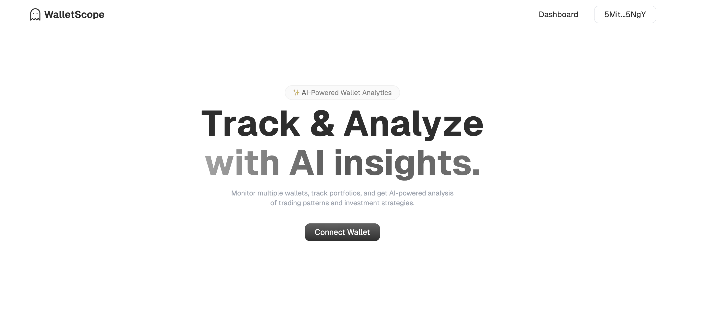

# WalletScope

WalletScope is an AI-powered wallet analytics platform for Solana, offering comprehensive portfolio tracking and intelligent insights through advanced analysis.



## Features

### 🧠 AI-Powered Analysis

- Intelligent wallet activity analysis
- Trading pattern recognition
- Portfolio composition insights
- Risk assessment and recommendations
- Powered by Google's Gemini AI

### 👛 Multi-Wallet Tracking

- Track multiple wallets simultaneously
- Real-time portfolio monitoring
- NFT collection tracking
- Transaction history visualization
- Comprehensive wallet overview

### 📊 Portfolio Analytics

- Real-time token price tracking
- NFT valuations
- Historical performance tracking
- Portfolio composition breakdown
- Transaction analytics

## Tech Stack

- **Frontend**: Next.js 14, React, TypeScript, TailwindCSS
- **AI**: Google Gemini AI
- **Blockchain**: Solana
- **Authentication**: Reown AppKit
- **Styling**: Framer Motion, Hugeicons
- **State Management**: React Context
- **Data Fetching**: REST APIs

## Getting Started

1. Clone the repository:

```bash
git clone https://github.com/starc007/wallet-insights.git
```

2. Install dependencies:

```bash
npm install
```

3. Set up environment variables: (create a .env file in the root directory)

```env
GEMINI_API_KEY=your_gemini_api_key
NEXT_PUBLIC_REOWN_PROJECT_ID=your_reown_project_id
NEXT_PUBLIC_HELIUS_KEY=your_helius_api_key
```

4. Run the development server:

```bash
npm run dev
```

5. Open [http://localhost:3000](http://localhost:3000) in your browser.
